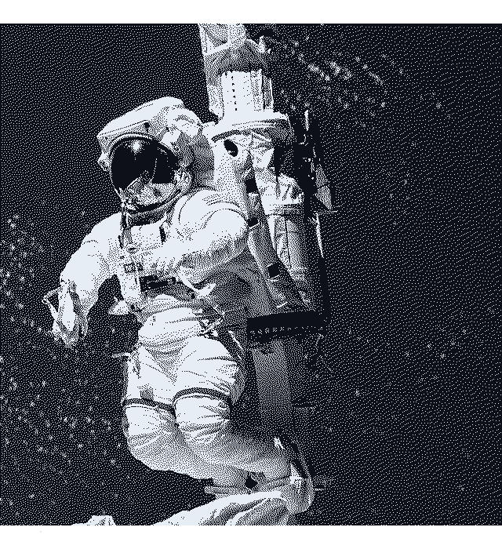

  

# Hi 👋, I'm Mayank Bhaskar

<h3 align="center">AI & Full-Stack Developer</h3>

  

  Building random ideas into useful software — AI, automation, open source &amp; web.

  

## 🚀 About Me

<table>
<tr>
<td width="65%" valign="top">

**Mayank here** — an ADHD-powered builder obsessed with turning random ideas into useful software. I work across **AI, full-stack, automation and open source**, and I'd rather ship a real product than talk about one.

I enjoy building **scalable, production-ready tools** with clean architecture — from desktop music players to Telegram automation to developer CLIs. Every project is a chance to learn something new and make it real.

Currently deep in **Next.js, PostgreSQL, Rust and AI/ML**, sharpening my problem-solving skills by building and shipping constantly.

My goal is simple: **write clean code, ship useful things, and build software that lasts.**

</td>
<td width="35%" valign="top">

</td>
</tr>
</table>

  

## ⚡ Things I've Built

<table>
<tr>
<td width="33%" valign="top">
  
</td>
<td width="33%" valign="top">
  
</td>
<td width="33%" valign="top">
  
</td>
</tr>
</table>

  

## 🤝 Connect

  &nbsp;&nbsp;&nbsp;
  &nbsp;&nbsp;&nbsp;
  &nbsp;&nbsp;&nbsp;
  &nbsp;&nbsp;&nbsp;
  

  

## 💻 Tech Stack

  

  &nbsp;
  &nbsp;
  &nbsp;
  &nbsp;
  &nbsp;
  &nbsp;
  &nbsp;
  &nbsp;
  &nbsp;
  &nbsp;
  &nbsp;
  &nbsp;
  &nbsp;
  &nbsp;
  &nbsp;
  &nbsp;
  &nbsp;
  &nbsp;
  

  

## 📊 GitHub Stats

  
  

  

## 📈 Activity Graph

  

  

## 🐍 Contribution Snake

  <picture>
    <source media="(prefers-color-scheme: dark)" srcset="https://raw.githubusercontent.com/qtjg/qtjg/gh-pages/github-snake-dark.svg">
    <source media="(prefers-color-scheme: light)" srcset="https://raw.githubusercontent.com/qtjg/qtjg/gh-pages/github-snake.svg">
    
  </picture>

