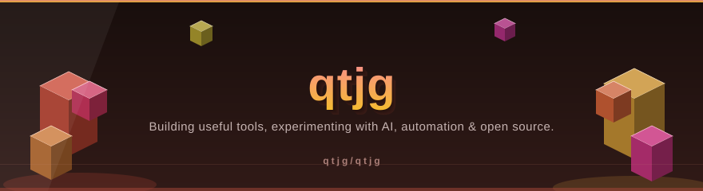
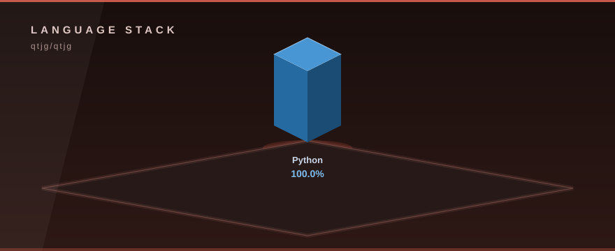

<p align="center">
  
</p>

<!-- ⬡ 3D-UPGRADE v1 by Mayank Bhaskar -->
<div align="center">

### 🧊 3D View



*Floating isometric render — layers hover, data particles stream, shine sweeps.*

</div>

---
🩺 **New tool — `repo-pulse`**: instant git pulse (28-day heat bars, hot files, contributors). Run: `python3 tools/repo_pulse.py`

<h1 align="center">Hey  I'm Mayank Bhaskar </h1>
<h3 align="center">AI & Full-Stack Developer | Builder | Open-Source Enthusiast</h3>

<p align="center">
  <a href="https://komarev.com/ghpvc/?username=qtjg">
    
  </a>
</p>


## 📌 About Me
- 🚀 Building AI, SaaS & developer tools
- 🧠 Exploring AI/ML & full-stack development
- 🔨 Turning ideas into real products
- 🤝 Open to cool collaborations
- 🎯 Building. Learning. Shipping.


## 🧠 My Focus Areas
- AI & Machine Learning
- Full-Stack Development
- SaaS & Product Building
- Developer Tools
- Automation
- Open Source


## 🚀 Projects

### 🔥 [hearth](https://github.com/qtjg/hearth)
**A full three-pane desktop music player for YouTube Music — Arch Linux, Windows & macOS.**
v0.7.0 "The Big Burn": artist pages, synced lyrics, 74 world stations, a self-healing
playback immune system, Discord Rich Presence, crossfade, plugins, ambient mixer —
588 tests green on a 3-OS CI matrix, and an animated 3D README mascot. PKGBUILD included.

### 🚪 [joingate](https://github.com/qtjg/joingate)
**One-time invite links, member gating and kick automation for Telegram groups & channels.**
Zero dependencies, runs on any JS runtime.


## 🟩 Contribution Graph — the real one

Every cube below is one real day pulled live from GitHub's GraphQL contribution
calendar — not a template, not someone else's snake. Regenerate anytime with
[`tools/generate_contribution_skyline.py`](tools/generate_contribution_skyline.py).

<p align="center">
  
</p>

<p align="center">
  <strong>422 contributions in the last year</strong> · 16 active days · peak <strong>69 in one day</strong> 🔥<br/>
  <sub>324 commits · 35 pull requests · 34 issues · snapshot 2026-09-14 · generated from real GitHub GraphQL data</sub>
</p>

<p align="center">
  
  
  
  
</p>

<p align="center">
  <picture>
    <source media="(prefers-color-scheme: dark)" srcset="https://raw.githubusercontent.com/qtjg/qtjg/gh-pages/github-snake-dark.svg">
    <source media="(prefers-color-scheme: light)" srcset="https://raw.githubusercontent.com/qtjg/qtjg/gh-pages/github-snake.svg">
    
  </picture>
</p>

## 📊 GitHub Stats & Trophies
<p align="center">
  <a href="https://github.com/qtjg">
    
  </a>
  
</p>
<p align="center">
  
</p>
<p align="center">
  
</p>


## 🛠️ Languages & Tools

<h3 align="center">Programming Languages</h3>
<p align="center">
  &nbsp;&nbsp;&nbsp;&nbsp;&nbsp;
  &nbsp;&nbsp;&nbsp;&nbsp;&nbsp;
  &nbsp;&nbsp;&nbsp;&nbsp;&nbsp;
  &nbsp;&nbsp;&nbsp;&nbsp;&nbsp;
  

</p>

<h3 align="center">Frontend</h3>
<p align="center">
  &nbsp;&nbsp;&nbsp;&nbsp;&nbsp;
  &nbsp;&nbsp;&nbsp;&nbsp;&nbsp;
  &nbsp;&nbsp;&nbsp;&nbsp;&nbsp;
  &nbsp;&nbsp;&nbsp;&nbsp;&nbsp;
  

</p>

<h3 align="center">Backend</h3>
<p align="center">
  

</p>

<h3 align="center">Database</h3>
<p align="center">
  &nbsp;&nbsp;&nbsp;&nbsp;&nbsp;
  &nbsp;&nbsp;&nbsp;&nbsp;&nbsp;
  

</p>

<h3 align="center">DevOps & Cloud</h3>
<p align="center">
  &nbsp;&nbsp;&nbsp;&nbsp;&nbsp;
  &nbsp;&nbsp;&nbsp;&nbsp;&nbsp;
  &nbsp;&nbsp;&nbsp;&nbsp;&nbsp;
  

</p>

<h3 align="center">Tools</h3>
<p align="center">
  &nbsp;&nbsp;&nbsp;&nbsp;&nbsp;
  &nbsp;&nbsp;&nbsp;&nbsp;&nbsp;
  

</p>

<p align="center">
  <a href="https://github.com/qtjg">
    
  </a>
</p>

## 🔗 Connect with Me
<p align="center">
  <a href="https://x.com/mayankbhaskarr">
    
  </a>&nbsp;&nbsp;&nbsp;
  <a href="https://www.youtube.com/@IndianCyberSecurity">
    
  </a>&nbsp;&nbsp;&nbsp;
  <a href="mailto:mayankbhaskardev@gmail.com">
    
  </a>
</p>

<p align="center"><a href="https://github.com/qtjg/hearth/issues/new"></a></p>

<div align="center">
  
</div>


---

## 🧊 3D Visuals

<p align="center">
  
</p>

Isometric 3D language stack computed from live GitHub language stats.
Regenerate the graphics any time with the built-in generator — stdlib only, zero dependencies:

```bash
python tools/generate_3d_assets.py
```
